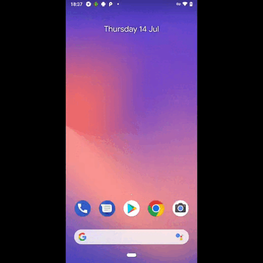

# Проект по автоматизации тестирования android-приложения  "Wikipedia"


#### <a target="_blank" href="https://github.com/wikimedia/apps-android-wikipedia/releases">Ссылка на репозиторий приложения</a>

## :floppy_disk: Содержание:

- <a href="#computer-технологии-и-инструменты">Технологии и инструменты</a>
- <a href="#notebook_with_decorative_cover-реализованные-проверки">Реализованные проверки</a>
- <a href="#jenkins-Jenkins-job">Сборка в Jenkins</a>
- <a href="#arrow_forward">Запуск из терминала</a>
- <a href="#Отчет BrowserStack">Отчет BrowserStack</a>
- <a href="#report-Allure-отчет">Allure отчет</a>
- <a href="#Allure-TestOPS">Allure Test Ops отчет</a>
- <a href="#telegram-Уведомление-в-Telegram-при-помощи-бота">Отчет в Telegram</a>
- <a href="#earth_africa-Примеры-видео-о-прохождении-тестов">Видео пример прохождения тестов</a>

## :computer: Технологии и инструменты
<p align="center">


</p>

## :notebook_with_decorative_cover: Реализованные проверки
- Проверка онбординга
- Проверка ввода текста 'Appium' в поисковую строку
- Проверка сохранения истории запросов 
- Проверка текста на стартовом экране
- Проверка существования кнопки 'Donate'

<a name="jenkins-Jenkins-job"></a>
###   Сборка в Jenkins
###  Запуск тестов в [Jenkins](https://jenkins.autotests.cloud/job/mobile_tests_diplom/)
*Для запуска сборки необходимо нажать кнопку <code><strong>*Собрать с параметрами*</strong></code> и указать значения параметров.*

<p align="center">
  
</p>

## :arrow_forward: Запуск из терминала
Локальный запуск:
```
gradle clean test -DdeviceHost=local
```
Запуск в Jenkins:
```
gradle clean test -DdeviceHost=browserstack
```

## Отчет BrowserStack


<a name="report-Allure-отчет"></a>
###  Отчёт [Allure Reports](https://jenkins.autotests.cloud/job/mobile_tests_diplom/2/allure/)
<p align="center">
  
</p>

<p align="center">
  
</p>

<a name="Allure-TestOPS"></a>
###  Интеграция с [Allure TestOps](https://allure.autotests.cloud/launch/14342)
<p align="center">
  
</p>

<p align="center">
  
</p>

<a name="telegram-Уведомление-в-Telegram-при-помощи-бота"></a>
###  Отчет в Telegram

<p align="center">
  
</p>

<a name="earth_africa-Примеры-видео-о-прохождении-тестов"></a>
### Видео прохождения тестов

> К каждому тесту в отчете прилагается видео.
<p align="center">
  
</p>
